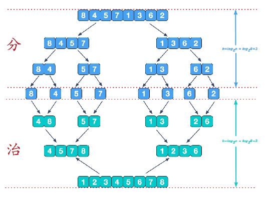
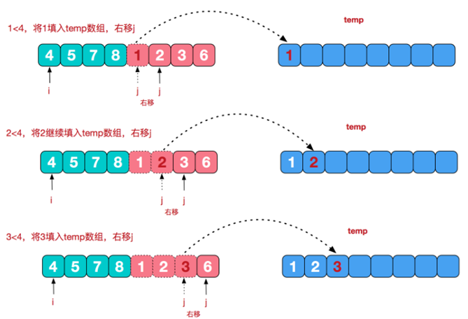
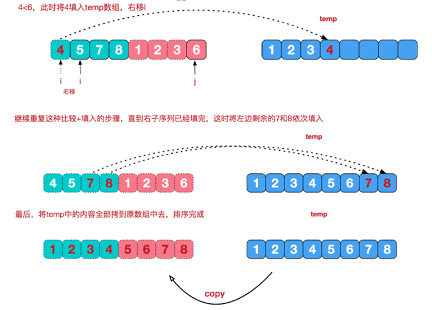
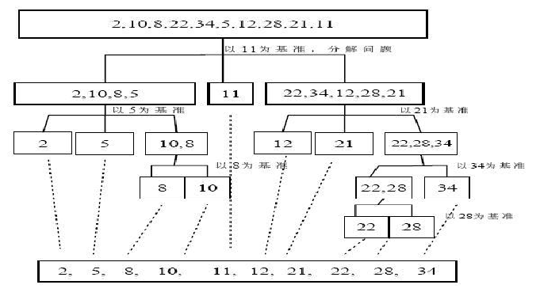

# 2. 排序

##  选择排序

1. **基本介绍**

选择式排序也属于内部排序法，是从欲排序的数据中，按指定的规则选出某一元素，再依规定交换位置后达到排序的目的。

2. **选择排序思想**

选择排序（select sorting）也是一种简单的排序方法。它的基本思想是：

**第一次**从arr[**0**]~arr[**n-1**]中**选取最小值**，与arr[**0**]交换；

**第二次**从arr[**1**]~arr[**n-1**]中**选取最小值**，与arr[**1**]交换；

**第三次**从arr[**2**]~arr[**n-1**]中**选取最小值**，与arr[**2**]交换；

……

**第i次**从arr[**i-1**]~arr[**n-1**]中**选取最小值**，与arr[**i-1**]交换；

**第n-1次**从arr[**n-2**]~arr[**n-1**]中选取最小值，与arr[**n-2**]交换；

**总共**通过**n-1**次，得到一个按排序码从小到大排列的有序序列。

3. **代码**

   ```c
   void selectSort(int arr[], int len)
   {
     for (int i = 0; i < len - 1; i++)
     {
       int minVal = arr[i];
       int minIndex = i;
       for (int insertIndex = i + 1; insertIndex < len; insertIndex++)
       {
         if (arr[insertIndex] < minVal)
         {
           minVal = arr[insertIndex + 1];
           minIndex = insertIndex + 1;
         }
       }
       //交换arr[i] 与 minVal
       arr[minIndex] = arr[i];
       arr[i] = minVal;
     }
   }
   ```

## 插入排序

1. **插入排序法介绍**

插入式排序属于内部排序法，是对于欲排序的元素以插入的方式找寻该元素的适当位置，以达到排序的目的。

2. **插入排序法思想**

插入排序（Insertion Sorting）的**基本思想**是：把n个待排序的元素看成为一个**有序表**和一个**无序表**，开始时有序表中**只包含一个元素**，无序表中包含有**n-1**个元素，排序过程中每次从无序表中**取出第一个元素**，把它的排序码依次与有序表元素的排序码进行比较，将它插入到有序表中的适当位置，使之成为新的有序表。

3. **时间复杂度**
   - 平均情况下插入排序需要 \~N<sup>2</sup>/4 比较以及 \~N<sup>2</sup>/4 次交换；
   - 最坏的情况下需要 \~N<sup>2</sup>/2 比较以及 \~N<sup>2</sup>/2 次交换，最坏的情况是数组是倒序的；
   - 最好的情况下需要 N-1 次比较和 0 次交换，最好的情况就是数组已经有序了。

```c
void insertSort(int arr[], int len)
{
  for (int i = 1; i < len; i++)
  {
    //待插入的位置
    int insertIndex = i - 1;
    //寻找插入位置
    while (insertIndex >= 0 && arr[insertIndex] > arr[i])
    {
      arr[insertIndex + 1] = arr[insertIndex];
      insertIndex--;
    }
    arr[insertIndex + 1] = arr[i];
  }
}
```

## 归并排序

### **归并排序介绍**

归并排序（MERGE-SORT）是利用**归并的思想**实现的排序方法，该算法采用经典的**分治**（divide-and-conquer）**策略**（分治法将问题分(divide)成一些小的问题然后**递归求解**，而治(conquer)的阶段则将分的阶段得到的各答案"修补"在一起，即分而治之)。

### **归并排序思想示意图







### 代码实现

```c++

void merge(int arr[], int l1, int r1, int l2, int r2)
{
  int i = l1, j = l2;
  int temp[r2 - i + 1];
  int index = 0;
  while (i <= r1 && j <= r2)
  {
    if (arr[i] <= arr[j])
    {
      temp[index++] = arr[i++];
    }
    else
    {
      temp[index++] = arr[j++];
    }
  }
  //左子数组有剩余
  while (i <= r1)
  {
    temp[index++] = arr[i++];
  }
  while (j <= r2)
  {
    temp[index++] = arr[j++];
  }
  //重新写回数组arr
  for (int i = 0; i < index; i++)
  {
    arr[l1 + i] = temp[i];
  }
}

void mergeSort(int arr[], int l, int r)
{
  if (l < r)
  {
    int mid = (int)floor(1.0 * (r + l) / 2);
    //将左子区间[left,mid]归并排序
    mergeSort(arr, l, mid);
    //将右子区间[mid,right]归并排序
    mergeSort(arr, mid + 1, r);
    //将左子区间和右子区间合并
    merge(arr, l, mid, mid + 1, r);
  }
}


```

```java
		public static void mergeSort(int[] arr, int left, int right, int[] temp) {
				if(left < right) {
					int mid = (left + right) / 2; //中间索引
					//向左递归进行分解
					mergeSort(arr, left, mid, temp);
					//向右递归进行分解
					mergeSort(arr, mid + 1, right, temp);
					//合并
					merge(arr, left, mid, right, temp);
				}
			}
			//合并的方法
			/**
			 * 
			 * @param arr 排序的原始数组
			 * @param left 左边有序序列的初始索引
			 * @param mid 中间索引
			 * @param right 右边索引
			 * @param temp 做中转的数组
			 */
			public static void merge(int[] arr, int left, int mid, int right, int[] temp) {
				int i = left; // 初始化i, 左边有序序列的初始索引
				int j = mid + 1; //初始化j, 右边有序序列的初始索引
				int t = 0; // 指向temp数组的当前索引
				//(一)
				//先把左右两边(有序)的数据按照规则填充到temp数组
				//直到左右两边的有序序列，有一边处理完毕为止
				while (i <= mid && j <= right) {//继续
					//如果左边的有序序列的当前元素，小于等于右边有序序列的当前元素
					//即将左边的当前元素，填充到 temp数组 
					//然后 t++, i++
					if(arr[i] <= arr[j]) {
						temp[t] = arr[i];
						t += 1;
						i += 1;
					} else { //反之,将右边有序序列的当前元素，填充到temp数组
						temp[t] = arr[j];
						t += 1;
						j += 1;
					}
				}
				//(二)
				//把有剩余数据的一边的数据依次全部填充到temp
				while( i <= mid) { //左边的有序序列还有剩余的元素，就全部填充到temp
					temp[t] = arr[i];
					t += 1;
					i += 1;    
				}
				while( j <= right) { //右边的有序序列还有剩余的元素，就全部填充到temp
					temp[t] = arr[j];
					t += 1;
					j += 1;    
				}
				//(三)
				//将temp数组的元素拷贝到arr
				//注意，并不是每次都拷贝所有
				t = 0;
				int tempLeft = left; // 
				//第一次合并 tempLeft = 0 , right = 1 //  tempLeft = 2  right = 3 // tL=0 ri=3
				//最后一次 tempLeft = 0  right = 7
				while(tempLeft <= right) { 
					arr[tempLeft] = temp[t];
					t += 1;
					tempLeft += 1;
				}
			}
		}

```


## 快速排序

### **快速排序法介绍**

**快速排序**（Quicksort）是对**冒泡排序的一种改进**。**基本思想**是：通过一趟排序将要排序的数据**分割**成独立的**两部分**，其中一部分的所有数据都比另外一部分的所有数据都要小，然后再按此方法对这两部分数据分别进行快速排序，整个排序过程可以递归进行，以此达到整个数据变成有序序列。

### 基本思想



### 代码实现

```c

/**
 * @Descripttion: 根据第一个元素划分数组
 * @param {int} arr
 * @param {int} left
 * @param {int} right
 * @return {*}
 */
int partition(int arr[], int left, int right)
{
  int temp = arr[left];
  while (left < right)
  {
    while (left < right && arr[right] > temp)
    {
      right--;
    }
    arr[left] = arr[right];
    while (left < right && arr[left] < temp)
    {
      left++;
    }
    arr[right] = arr[left];
  }
  arr[left] = temp;
  //返回相遇的下标
  return left;
}

/**
 * @Descripttion: 随即确定一个元素划分数组
 * @param {int} arr
 * @param {int} left
 * @param {int} right
 * @return {*}
 */
int randPartition(int arr[], int left, int right)
{
  //生成[left,right]范围内的数
  int random = rand() % (right - left + 1) + left;
  swap(arr[random], arr[left]);
  int temp = arr[left];
  while (left < right)
  {
    while (left < right && arr[right] > temp)
    {
      right--;
    }
    arr[left] = arr[right];
    while (left < right && arr[left] < temp)
    {
      left++;
    }
    arr[right] = arr[left];
  }
  arr[left] = temp;
  //返回相遇的下标
  return left;
}

void quickSort(int arr[], int left, int right)
{
  //当前区间长度超过1
  if (left < right)
  {
    int pos = partition(arr, left, right);
    //对左子区间递归进行快速排序
    quickSort(arr, left, pos - 1);
    //对右子区间递归进行快速排序
    quickSort(arr, pos + 1, right);
  }
}

int main(){
  //生成随机数的种子
  srand((unsigned)time(NULL));
  for (int i = 0; i < 10; i++)
  {
    printf("%d ", rand());
  }
  printf("\n");
  //生成[a,b]内的随机数
  for (int i = 0; i < 10; i++)
  {
    //s[3,7]内的随机数
    printf("%d ", rand() % 5 + 3);
  }

  return 0;
}
```


## qsort（C）

```c
void qsort(void *base, size_t nitems, size_t size, int (*compar)(const void *, const void*))
```


```c

#include <stdio.h>
#include <stdlib.h>
int values[] = { 88, 56, 100, 2, 25 };

int cmpfunc (const void * a, const void * b)
{
   //可能溢出
   return ( *(int*)a - *(int*)b );
   /**int small_negative_val = (int)(0x80000000); // -2147483648
   int big_positive_val = 0x7fffffff; // 2147483647
   printf("%d", cmpfunc(&small_negative_val, &big_positive_val));
   //输出1。负数减正数却得出了正数，代表结果已经溢出，不再可靠。*/
}
//避免溢出
int cmpfunc (const void * a, const void * b)
{
    const int *aa = a;
    const int *bb = b;
    if (*aa < *bb)
        return -1;
    else if (*aa > *bb)
        return 1;
    else 
        return 0;
}
int main()
{
   int n;

   printf("排序之前的列表：\n");
   for( n = 0 ; n < 5; n++ ) {
      printf("%d ", values[n]);
   }

   qsort(values, 5, sizeof(int), cmpfunc);

   printf("\n排序之后的列表：\n");
   for( n = 0 ; n < 5; n++ ) {
      printf("%d ", values[n]);
   }
 
  return(0);
}

//结构体排序
#include <iostream>
#include <stdlib.h>
#include <string.h>
using namespace std;
#define NUM 5
struct Student{
    unsigned ID;
    char szName[20];
    float fGPA;
};
Student MyClass[NUM]={
    {1234,"Tom",3.78},
    {1345,"Sam",2.12},
    {1235,"Bob",4.77},
    {1456,"Echo",1.34},
    {1578,"Amy",3.04},
};
 
int IDCompare(const void * elem1,const void * elem2)
{
    Student * stu1 = (Student*)elem1;
    Student * stu2 = (Student*)elem2;
    return (*stu1).ID-(*stu2).ID;
}
int NameCompare(const void * elem1, const void * elem2)
{
    Student * stu1 = (Student*)elem1;
    Student * stu2 = (Student*)elem2;
    return strcmp(stu1->szName,stu2->szName);
}
int main()
{
    qsort(MyClass,NUM,sizeof(Student),IDCompare);
    for(int i=0;i<NUM;i++)
        cout<<MyClass[i].szName<<" ";
    cout<<endl;
    qsort(MyClass,NUM,sizeof(Student),NameCompare);
    for(int i=0;i<NUM;i++)
        cout<<MyClass[i].szName<<" ";
    return 0;
}
```

参数

- **base** -- 指向要排序的数组的第一个元素的指针。
- **nitems** -- 由 base 指向的数组中元素的个数。
- **size** -- 数组中每个元素的大小，以字节为单位。
- **compar** -- 用来比较两个元素的函数。

compar 参数指向一个比较两个元素的函数。比较函数的原型应该像下面这样。注意两个形参必须是 **const void \*** 型，同时在调用 compar 函数（compar 实质为函数指针，这里称它所指向的函数也为 compar）时，传入的实参也必须转换成**const void \*** 型。在 compar 函数内部会将 **const void \*** 型转换成实际类型，见下文。

```c
int compar(const void *p1, const void *p2);
```

如果 compar 返回值小于 0（< 0），那么 p1 所指向元素会被排在p2所指向元素的前面；如果 compar 返回值等于 0（= 0），那么 p1 所指向元素与 p2 所指向元素的顺序不确定；如果 compar 返回值大于 0（> 0），那么 p1 所指向元素会被排在 p2 所指向元素的后面。

返回值

该函数不返回任何值。

## sort（C++）

# 图

## 基本概念

度：和该顶点相连的边数；对有向图来说，顶点的出边条数成为出度，反之称为入度。

## 图的存储

### 邻接矩阵

```c++
G[i][j] //顶点i到j 不连接 = INF; 连接= 边权
```


### 邻接表--顶点个数1000以上

同一个顶点的所有出边放在一个列表，N个顶点对应N个列表，没有出边，对应空表。

邻接表只存放每条边的终点编号

```c++
vector <int> Adj[N];
```

邻接表存放每条边的终点编号和边权

```c++
struct Node{
    //边的终点编号
    int v;
    //边权
    int w;
};
vector <int> Adj[N];
```

## 图的遍历

### 深度优先搜索（DFS)

**定义：**沿着一条路径直到无法继续前进，才退回到路径上离当前顶点最近的还存在未访问分支顶点的岔道口，并继续访问那些未访问分支结点。

**连通分量**：无向图中，两个顶点之间可以相互到达（可以通过一定路径间接到达）则称这两个顶点**连通**。任意两个顶点都连通，则称图G为**连通图**，其中的极大连通子图为**连通分量（连通块）**。（不要理解为最大的连通子图）

**强连通分量**：有向图中，两个顶点之间可以相互到达（可以通过一定路径间接到达）则称这两个顶点**强连通**。任意两个顶点都连通，则称图G为**强连通图**，其中的极大强连通子图为**强连通分量（连通块）**。

```c++
#include <stdio.h>
#include <vector>
using namespace std;

//最大顶点数
const int MAXN = 1000;
//无穷大 表示不能到达
const int INF = 1000000000;
//顶点个数
int n;
//邻接矩阵
int G[MAXN][MAXN];
//图G的邻接表
vector<int> Adj[MAXN];
//如果顶点i已被访问 则vis[i] = true
bool vis[MAXN] = {false};

/**
 * @Descripttion: 图的深度优先遍历-邻接矩阵实现
 * @param {int} u
 * @param {int} depth
 * @return {*}
 */
void DFS(int u, int depth)
{
	//访问u
	vis[u] = true;
	//访问u的邻接点
	for (int v = 0; v < n; v++)
	{
		if (vis[v] == false && G[u][v] != INF)
		{
			DFS(v, depth + 1);
		}
	}
}

/**
 * @Descripttion: 图的深度优先遍历-邻接表实现
 * @param {int} u 为当前访问的顶点标号 
 * @param {int} depth 深度
 * @return {*}
 */
void DFS(int u, int depth)
{
	vis[u] = true;
	//需要对u进行一些操作 可在此处处理
	for (int i = 0; i < Adj[u].size(); i++)
	{
		int v = Adj[u][i];
		if (vis[v] == false)
		{
			DFS(v, depth + 1);
		}
	}
}

//遍历图G
void DFSTrave()
{
	//对每个顶点u
	for (int u = 0; u < n; u++)
	{
		//如果u未被访问
		if (vis[u] == false)
		{
			//访问u和u所在的连通块 1表示初始为第一层
			DFS(u, 1);
		}
	}
}

```

### 广度优先搜索（BFS)

```c++

#include <stdio.h>
#include <queue>

using namespace std;

//当需要输出层时  就要存储结点
struct node
{
  //顶点的编号
  int v;
  //顶点层号
  int layer;
};
//最大顶点数
const int MAXN = 1000;
//无穷大 表示不能到达
const int INF = 1000000000;
//顶点数
int n;
//图的邻接矩阵
int G[MAXN][MAXN];
//图的邻接表
vector<int> Adj[MAXN];
vector<node> AdjNode[MAXN];

//如果顶点i已被访问 则inq[i] = true
bool inq[MAXN] = {false};

//图的遍历-邻接矩阵
void BFS(int u)
{
  queue<int> q;
  q.push(u);
  //设置u已被加入过队列
  inq[u] = true;
  while (!q.empty())
  {
    int u = q.front();
    //枚举u的所有相邻结点
    for (int v = 0; v < n; v++)
    {
      //如果u的领结点v未加入队列且通过u可达
      if (inq[v] == false && G[u][v] != INF)
      {
        q.push(v);
        inq[v] = true;
      }
    }
  }
}

//图的遍历-邻接表
void BFS(int u)
{
  queue<int> q;
  q.push(u);
  inq[u] = true;
  while (!q.empty())
  {
    q.front();
    for (int i = 0; i < Adj[u].size(); i++)
    {
      if (inq[Adj[u][i]] == false)
      {
        q.push(Adj[u][i]);
        inq[Adj[u][i]] = true;
      }
    }
  }
}

//考虑层号的输出
void BFS(int s)
{
  queue<node> q;
  node start;
  start.v = s;
  start.layer = 0;
  q.push(start);
  //起始点的编号设为已被加入队列
  inq[start.v] = true;
  while (!q.empty())
  {
    //取出队首元素
    node topNode = q.front();
    q.pop();
    int u = topNode.v;
    for (int i = 0; i < AdjNode[u].size(); i++)
    {
      //从u出发能到达的顶点
      node next = AdjNode[u][i];
      next.layer = topNode.layer + 1;
      if (inq[next.v] == false)
      {
        q.push(next);
        //next的编号设为已被加入过队列
        inq[next.v] = true;
      }
    }
  }
}

void BFSTrave()
{
  for (int u = 0; u < n; u++)
  {
    if (inq[u] == false)
    {
      BFS(u);
    }
  }
}
```

## 最短路径

### Dijkstra算法

#### 邻接矩阵实现

```c++
#include <stdio.h>
#include <algorithm>
#include <vector>
using namespace std;

//最大顶点数
const int MAXV = 1000;
//设置无穷大 表示两点没有连接
const int INF = 1000000000;

//顶点数量 连接矩阵 起点到各点的最短路径长度 表示从起点到顶点v的最短路径上v的前一个顶点
int n, G[MAXV][MAXV], dis[MAXV], pre[MAXV];
//标记数组 vis=true表示已访问
bool vis[MAXV] = {false};

/**
 * @Descripttion: 连接矩阵实现
 * @param {int} s
 * @return {*}
 */
void Dijkstra(int s)
{
  //fill函数将整个d数组赋为INF
  fill(dis, dis + MAXV, INF);
  //初始状态设置每个结点的前驱结点为自身
  for (int i = 0; i < n; i++)
  {
    pre[i] = i;
  }

  dis[s] = 0;
  //n个顶点 循环n次
  for (int i = 0; i < n; i++)
  {
    //使dis[u]最小的还未被访问的顶点标号
    int u = -1;
    //存放最小的d[]
    int min = INF;
    for (int j = 0; j < n; j++)
    {
      if (vis[j] == false && dis[j] < min)
      {
        u = j;
        min = dis[j];
      }
    }
    //没有找到最小的u 说明与s均不相连
    if (u == -1)
    {
      return;
    }
    vis[u] = true;
    for (int v = 0; v < n; v++)
    {
      //如果v未被访问&& u能到达v && 以u为中介到达v距离更小
      if (vis[v] == false && G[u][v] != INF && dis[v] > G[u][v] + dis[u])
      {
        //优化dis[v]
        dis[v] = G[u][v] + dis[u];
        pre[v] = u;
      }
    }
  }
}

/**
 * @Descripttion: 输出路径
 * @param {int} s 起点
 * @param {int} v 终点
 * @return {*}
 */
void DFS(int s, int v)
{
  if (v == s)
  {
    printf("%d\n", s);
    return;
  }
  DFS(s, pre[v]);
  //从最深处return回来之后 输出每一层的顶点编号
  printf("%d\n", v);
}
```

#### 邻接表实现

```c++
#include <stdio.h>
#include <vector>
#include <algorithm>

using namespace std;

struct Node
{
  //v为边的目标顶点 dis为边权
  int v, dis;
};

//最大顶点数
const int MAXV = 1000;
//设置无穷大 表示两点没有连接
const int INF = 1000000000;

//顶点数量 起点到各点的最短路径长度 表示从起点到顶点v的最短路径上v的前一个顶点
int n, dis[MAXV], pre[MAXV];
//标记数组 vis=true表示已访问
bool vis[MAXV] = {false};

vector<Node> Adj[MAXV];

void dijkstra(int s)
{
  //fill函数将整个d数组赋为INF
  fill(dis, dis + MAXV, INF);
  //初始状态设置每个结点的前驱结点为自身
  for (int i = 0; i < n; i++)
  {
    pre[i] = i;
  }
  dis[s] = 0;
  //n个顶点 循环n次
  for (int i = 0; i < n; i++)
  {
    //使dis[u]最小的还未被访问的顶点标号
    int u = -1;
    //存放最小的d[]
    int min = INF;
    for (int j = 0; j < n; j++)
    {
      if (vis[j] == false && dis[j] < min)
      {
        u = j;
        min = dis[j];
      }
    }
    //没有找到最小的u 说明与s均不相连
    if (u == -1)
    {
      return;
    }
    vis[u] = true;
    for (int j = 0; j < Adj[u].size(); j++)
    {
      //如果v未被访问 && 以u为中介到达v距离更小
      int v = Adj[u][j].v;
      if (vis[v] == false && dis[v] > Adj[u][j].dis + dis[u])
      {
        //优化dis[v]
        dis[v] = dis[u] + Adj[u][j].dis;
      }
    }
  }
}

/**
 * @Descripttion: 输出路径
 * @param {int} s 起点
 * @param {int} v 终点
 * @return {*}
 */
void DFS(int s, int v)
{
  if (v == s)
  {
    printf("%d\n", s);
    return;
  }
  DFS(s, pre[v]);
  //从最深处return回来之后 输出每一层的顶点编号
  printf("%d\n", v);
}

```

#### 考虑第二标尺的最短路径

##### 新增边权

```c++
//cost[u][v]表示u->v的花费 由题目给出
//增加一个数组c[],表示从起点到达顶点u的最少花费为c[u],只有c[s]初始化为0，其余为INF
for (int v = 0; v < n; v++)
    {
      //如果v未被访问&& u能到达v && 以u为中介到达v距离更小
      if (vis[v] == false && G[u][v] != INF)
      {
        if (dis[v] > G[u][v] + dis[u])
        {
          //优化dis[v]
          dis[v] = G[u][v] + dis[u];
          c[v] = c[u] + cost[u][v];
          pre[v] = u;
          num[v] = num[u];
        }
          //距离相同时 看能否使c[v]更优
        else if (dis[u] + G[u][v] == dis[v] && c[v] > c[u] + cost[u][v])
        {
          c[v] = c[u] + cost[u][v];
          pre[v] = u;
          num[v] += num[u];
        }
      }
    }
```

##### 新增点权

```c++
//weight[u]表示u可收集的物资 由题目给出
//增加一个数组w[],表示从起点到达顶点u可收集的最大物资w[u],只有w[s]初始化为weight[s]，其余为INF
for (int v = 0; v < n; v++)
    {
      //如果v未被访问&& u能到达v && 以u为中介到达v距离更小
      if (vis[v] == false && G[u][v] != INF)
      {
        if (dis[v] > G[u][v] + dis[u])
        {
          //优化dis[v]
          dis[v] = G[u][v] + dis[u];
          w[v] = w[u] + weight[v];
        }
          //距离相同时 看能否使c[v]更优
        else if (dis[u] + G[u][v] == dis[v] && w[v] < w[u] + weight[v])
        {
          w[v] = w[u] + weight[v];         
        }
      }
    }
```

##### 最短路径条数

```c++
//num[]表示s->u的最短路径条数 s:起点
//num[s] = 1 其余为0
for (int v = 0; v < n; v++)
    {
      //如果v未被访问&& u能到达v && 以u为中介到达v距离更小
      if (vis[v] == false && G[u][v] != INF)
      {
        if (dis[v] > G[u][v] + dis[u])
        {
          //优化dis[v]
          dis[v] = G[u][v] + dis[u];
          c[v] = c[u] + cost[u][v];
          pre[v] = u;
          num[v] = num[u];
        }
          //距离相同时 看能否使c[v]更优
        else if (dis[u] + G[u][v] == dis[v] && c[v] > c[u] + cost[u][v])
        {
          c[v] = c[u] + cost[u][v];
          pre[v] = u;
          num[v] += num[u];
        }
      }
    }
```

##### Dijkstra+DFS

```c++
#include <stdio.h>
#include <vector>
#include <algorithm>
using namespace std;

//最大顶点数
const int MAXV = 1000;
//设置无穷大 表示两点没有连接
const int INF = 1000000000;
//顶点数量 路径矩阵 起点
int n, G[MAXV][MAXV], st;
//起点到各点的最短路径长度 记录题目中添加的额外边权代价信息 从题目中获取
int dis[MAXV], cost[MAXV][MAXV], weight[MAXV];
//标记数组 vis=true表示已访问
bool vis[MAXV] = {false};
//表示从起点到顶点v的最短路径上v的前一个顶点
vector<int> pre[MAXV];

/**
 * @Descripttion: 连接矩阵实现
 * @param {int} s
 * @return {*}
 */
void Dijkstra(int s)
{
  //fill函数将整个d数组赋为INF
  fill(dis, dis + MAXV, INF);
  dis[s] = 0;
  //n个顶点 循环n次
  for (int i = 0; i < n; i++)
  {
    //使dis[u]最小的还未被访问的顶点标号
    int u = -1;
    //存放最小的d[]
    int min = INF;
    for (int j = 0; j < n; j++)
    {
      if (vis[j] == false && dis[j] < min)
      {
        u = j;
        min = dis[j];
      }
    }
    //没有找到最小的u 说明与s均不相连
    if (u == -1)
    {
      return;
    }
    vis[u] = true;
    for (int v = 0; v < n; v++)
    {
      //如果v未被访问&& u能到达v && 以u为中介到达v距离更小
      if (vis[v] == false && G[u][v] != INF)
      {
        if (dis[v] > G[u][v] + dis[u])
        {
          //优化dis[v]
          dis[v] = G[u][v] + dis[u];
          pre[v].clear();
          pre[v].push_back(u);
        }
        else if (dis[v] == G[u][v] + dis[u])
        {
          pre[v].push_back(u);
        }
      }
    }
  }
}
//最优路径和临时路径
vector<int> path, tempPath;
//第二标尺最优值
int optValue;
/**
 * @Descripttion: 输出路径
 * @param {int} v 当前访问的结点
 * @return {*}
 */
void DFS(int v)
{
  //递归边界
  if (v == st) //到达了叶子结点
  {
    tempPath.push_back(v);
    int value;
    //此处添加计算第二标尺的value值
    //边权
    for (int i = tempPath.size() - 1; i > 0; i--)
    {
      //当前结点id 下一结点idNext
      int id = tempPath[i], idNext = tempPath[i - 1];
      value += cost[id][idNext];
    }
    //点权
    for (int i = tempPath.size() - 1; i >= 0; i--)
    {
      //当前结点id 下一结点idNext
      int id = tempPath[i];
      value += weight[id];
    }
    if (value < optValue)
    {
      optValue = value;
      path = tempPath;
    }
    //将刚加入的结点删除
    tempPath.pop_back();
    return;
  }
  //递归式
  tempPath.push_back(v);
  for (int i = 0; i < pre[v].size(); i++)
  {
    //结点v的前驱结点pre[v][i] 递归
    DFS(pre[v][i]);
  }

  //遍历完所有结点 删除v
  tempPath.pop_back();
}
```

### Bellman-Ford算法

## 最小生成树

一个给定的无向图中求一棵树，使得这棵树拥有图中所有顶点，且边权之和最小。

**性质**

1. 最小生成树是树，因此其边数等于顶点数减1，且树内一定不会有环；
2. 对给定的图G(V,E)，其最小生成树可以不唯一，但是边权之和一定是唯一的；
3. 由于最小生成树是在无向图上生成的，因此根节点可以是这棵树上的任意一个结点。

### prim算法--边多的情况

**基本思想：**对图设置集合S，存放已被访问的顶点，然后每次从集合V-S中选择与集合S的最短距离最小的一个顶点u，访问并加入集合S。之后，令顶点u为中介点，优化所有从u能到达的顶点v与集合S之间的最短距离。重复n次（n为顶点个数），直到S中包含所有顶点。

#### 邻接矩阵版

```c
#include <stdio.h>
#include <algorithm>
using namespace std;

const int MAXN = 1000;
const int INF = 100000000;

int n, G[MAXN][MAXN];
//顶点与集合的最短距离
int dis[MAXN];
//标记是否被加入到集合中
bool vis[MAXN];

/**
 * @Descripttion: 默认0号位初始点
 * @param {*}
 * @return {*} 最小生成树的边权之和
 */
int prim()
{
  fill(dis, dis + MAXN, INF);
  dis[0] = 0;
  //存放最小生成树的边权之和
  int ans = 0;
  for (int i = 0; i < n; i++)
  {
    int u = -1, min = INF;
    for (int j = 0; j < n; j++)
    {
      if (vis[j] == false && dis[j] < min)
      {
        u = j;
        min = dis[j];
      }
    }

    if (u == -1)
    {
      return;
    }
    vis[u] = true;
    //将与集合最小的边加入最小生成树
    ans += dis[u];
    for (int v = 0; v < n; v++)
    {
      if (vis[v] == false && G[u][v] != INF && dis[v] > G[u][v])
      {
        //与Dijkstra相比 不是到起点的距离 而是到集合的距离
        dis[v] = G[u][v];
      }
    }
  }
  return ans;
}
```

#### 邻接表版

```c++
#include <cstdio>
#include <iostream>
#include <vector>
using namespace std;
const int MAXN = 100;
const int INF = 100000;
bool vis[MAXN] = {false};
int ans, n, dis[MAXN];

struct node
{
  int v, d;
};
vector<node> Adj[MAXN];
int prime()
{
  //默认0号为顶点
  dis[0] = 0;
  fill(dis, dis + MAXN, INF);
  //n个顶点 循环n次
  for (int i = 0; i < n; i++)
  {
    int u = -1, min = INF;
    for (int j = 0; j < n; j++)
    {
      if (vis[j] == false && dis[j] < min)
      {
        u = j;
        min = dis[j];
      }
    }
    if (u == -1)
    {
      return -1;
    }
    ans += dis[u];
    vis[u] = true;
    for (int j = 0; j < Adj[u].size(); j++)
    {
      int v = Adj[u][j].v;
      if (vis[v] == false && Adj[u][j].d < dis[v])
      {
        dis[v] = Adj[u][j].d;
      }
    }
  }
  return ans;
}
```

### kruskal算法--点多的情况

#### 基本思想

1. 对所有边按边权从小到大排序；
2. 按照排序后的结果测试所有边，如果当前边的两个端点不在同一个连通块，则把这条边加到最小生成树中，否则，舍弃该边；
3. 执行步骤2，直到最小生成树的边数等于总顶点数减1或者是测试完所有边时结束。如果最小生成树的边数小于总顶点数减1，说明该图不连通。

#### 代码实现

```c++
#include <stdio.h>
#include <algorithm>
using namespace std;
const int MAXN = 110;
const int MAXE = 10010;
struct edge
{
  //边的两个端点编号
  int u, v;
  //边权
  int cost;
} E[MAXE]; //最多有MAXE条边

bool cmp(edge a, edge b)
{
  return a.cost < b.cost;
}

//并查集部分
int father[MAXN];
int findFather(int x)
{
  int a = x;
  while (x != father[x])
  {
    x = father[x];
  }

  //路径压缩
  while (a != father[a])
  {
    int z = a;
    a = father[a];
    father[z] = x;
  }
  return x;
}

/**
 * @Descripttion: 
 * @param {int} n 顶点个数
 * @param {int} m 边数
 * @return {*}
 */
int kruskal(int n, int m)
{
  //边权之和 边的个数
  int ans = 0, edgeNum = 0;
  //并查集初始化--假设顶点从0开始编号
  for (int i = 0; i < n; i++)
  {
    father[i] = i;
  }
  sort(E, E + m, cmp);
  //枚举所有的边
  for (int i = 0; i < n; i++)
  {
    int faU = findFather(E[i].u);
    int faV = findFather(E[i].v);
    //不在一个集合中
    if (faU != faV)
    {
      //合并集合 即把测试边加入最小生成树
      father[faU] = faV;
      ans += E[i].cost;
      edgeNum++;
      if (edgeNum == n - 1)
        break;
    }
  }
  if (edgeNum != n - 1)
    return -1;
  else
  {
    return ans;
  }
}
```

### 拓扑排序

将有向无环图G的所有顶点排成一个线性序列，使得对图G中的任意两个顶点u，v，如果存在u->v，那么在序列中u一定在v前面。这个序列被称为拓扑序列。

#### 实现步骤

1. 定义一个队列Q，并把所有入度为0的结点加入队列；
2. 取队首结点，输出。然后删去所有从它出发的边，并令这些边到达的顶点的入度减1，如果某个顶点的入度减为0，则将其加入队列；
3. 反复进行2操作，直到队列为空。如果队列为空时入过队的结点数目恰好为N，说明拓扑排序成功，图G为有向无环图；否则，拓扑排序失败，图G中有环。

#### 代码实现

```c++
#include <stdio.h>
#include <vector>
#include <queue>
using namespace std;
const int MAXV = 1000;

vector<int> G[MAXV];

//顶点数 入度
int n, m, inDegree[MAXV];

//拓扑排序
bool topologicalSort()
{
  //记录加入拓扑序列的顶点数
  int num = 0;
  queue<int> q;
  for (int i = 0; i < n; i++)
  {
    //将所有入度为0的顶点入队
    if (inDegree[i] == 0)
    {
      q.push(i);
    }
  }
  while (!q.empty())
  {
    int u = q.front();
    //此处可以输出顶点u 作为拓扑序列中的顶点
    // printf("%d", u);
    q.pop();
    for (int i = 0; i < G[u].size(); i++)
    {
      int v = G[u][i];
      //顶点v的入度减1
      inDegree[v]--;
      if (inDegree[v] == 0)
      {
        q.push(v);
      }
    }
    //清空顶点u的出边(如务必要可不写)
    G[u].clear();
    num++;
  }

  if (num == n)
  {
    return true;
  }
  else
  {
    return false;
  }
}
```

### 关键路径

#### AOV网（Activity On Vertex）

顶点表示活动，边集表示活动间优先关系的有向图。

#### AOE网（Activity On Edge）

带权的边集表示活动（边权表示活动需要的时间），顶点表示事件的有向图。

#### 关键路径

AOE网中最长路径别称为关键路径

# 树

## 二叉树基本操作

```c++
#include <stdio.h>
#include <stdlib.h>
struct node
{
  int data;
  node *lchild;
  node *rchild;
};

//根节点为空
node *root = NULL;

/**
 * @Descripttion: 生成一个新节点
 * @param {int} v 新节点的权值
 * @return {*}
 */
node *newNode(int v)
{
  node *newNode = (node *)malloc(sizeof(node));
  newNode->data = v;
  newNode->lchild = newNode->rchild = NULL;
  return newNode;
}

/**
 * @Descripttion: 修改数据域为x的结点值为newData 
 * @param {node} *root
 * @param {int} x
 * @param {int} newData
 * @return {*}
 */
void modify(node *root, int x, int newData)
{
  if (root == NULL)
  {
    return;
  }
  if (root->data == x)
  {
    root->data = newData;
  }
  //往左子树递归查找
  modify(root->lchild, x, newData);
  modify(root->rchild, x, newData);
}

/**
 * @Descripttion: 插入结点
 * @param {int} val
 * @return {*}
 */
/**
 * 特别注意root使用了引用，即在函数中对root的修改会改变原变量的值
 * 如果不使用引用，root = newNode(val)这个语句对root的修改就不能
 * 作用到原变量（即上一层root->lchild与root->rchild） 即不能把
 * 新结点连接到二叉树上
 * ！！！如果函数中需要新建结点，即对二叉树的结构进行改变，就需要加引用
 * 只是修改当前已有结点的内容，或是遍历 不需要加引用
 */
void insert(node *&root, int val)
{
  //空树  说明查找失败 即插入位置
  if (root == NULL)
  {
    root = newNode(val);
    return;
  }

  //由二叉树的性质，val应该插在左子树
  if (root->lchild)
  {
    insert(root->lchild, val);
  }
  //由二叉树的性质，val应该插在右子树
  else
  {
    insert(root->rchild, val);
  }
}

/**
 * @Descripttion: 二叉树的创建
 * @param {int} data
 * @param {int} n
 * @return {*}
 */
node* creatBinaryTree(int data[], int n){
  node *root = NULL;
  for (int i = 0; i < n; i++)
  {
    insert(root, data[i]);
  }
  return root;
}
```

## 二叉树的遍历

先序遍历

```c
void preOrder(node *root)
{
  if (root == NULL) //到达空树，递归边界
  {
    return;
  }
  //访问根结点
  printf("%d\n", root->data);
  //访问左子树
  preOrder(root->lchild);
  //访问右子树
  preOrder(root->rchild);
}
```

中序遍历

```c
void inOrder(node *root)
{
  if (root == NULL) //到达空树，递归边界
  {
    return;
  }
  //访问左子树
  preOrder(root->lchild);
  //访问根结点
  printf("%d\n", root->data);
  //访问右子树
  preOrder(root->rchild);
}
```

后序遍历

```c
void postOrder(node *root)
{
  if (root == NULL) //到达空树，递归边界
  {
    return;
  }
  //访问左子树
  preOrder(root->lchild);
  //访问右子树
  preOrder(root->rchild);
  //访问根结点
  printf("%d\n", root->data);
}
```

层序遍历

```c
void layerOrder(node *root)
{
  //队列里存放地址-->实现对原元素的修改
  queue<node *> q;
  root->layer = 1;
  q.push(root);
  while (!q.empty())
  {
    //取出队首元素
    node *temp = q.front();
    printf("%d", temp->data);
    q.pop();
    //左子树非空
    if (temp->lchild)
    {
      temp->lchild->layer = temp->layer + 1;
      q.push(temp->lchild);
    }
    //右子树非空
    if (temp->rchild)
    {
      temp->rchild->layer = temp->layer + 1;
      q.push(temp->rchild);
    }
  }
}
```

##  静态写法

```c++
struct node
{
  int data;
  //指针域 存放所有子结点的下标
  vector<int> child;
  //层数
  int layer;
} Node[MAXN];
```

先序遍历

```c++
void preOrder(int root)
{
  printf("%d ", root);
  for (int i = 0; i < Node[root].child.size(); i++)
  {
    preOrder(Node[root].child[i]);
  }
}
```

层序遍历

```c++
void layerOrder(int root)
{
  queue<int> q;
  //根节点的层号为1
  Node[root].layer = 1;
  q.push(root);
  while (!q.empty())
  {
    int top = q.front();
    printf("%d ", Node[top].data);
    q.pop();
    for (int i = 0; i < Node[top].child.size(); i++)
    {
      //当前结点的第i个子结点的编号
      int child = Node[top].child[i];
      Node[child].layer = Node[top].layer + 1;
      q.push(child);
    }
  }
}
```

## 二叉查找树（BST)

### **二叉排序树介绍**

1. **二叉排序树**：BST: (Binary Sort(Search) Tree), 对于二叉排序树的任何一个非叶子节点，要求**左子节点**的值**比当前**节点的值**小**，**右**子节点的值**比当前**节点的值**大**。左子树(根节点左边)的值≤根节点的值；右子树的值≥根节点的值。

2. 特别说明：如果有**相同的值**，可以将该节点放在**左**子节点**或右**子节点

3. 二叉排序树不唯一（根节点不同）

### 基本操作

**查找**

```c
void search(node *root, int val)
{

  if (root == NULL)
  {
    printf("failed\n");
    return;
  }
  if (root->data == val)
  {
    printf("%d", root->data);
  }
  //往右子树递归查找
  else if (root->data < val)
  {
    search(root->rchild, val);
  }
  //往左子树递归查找
  else
  {
    search(root->lchild, val);
  }
}
```

插入

```c
void insert(node *&root, int val)
{

  if (root == NULL)
  {
    node *root = new node();
    root->data = val;
    return;
  }
  if (root->data == val)
  {
    return;
  }
  //往右子树递归插入
  if (root->data < val)
  {
    insert(root->rchild, val);
  }
  else
  {
    insert(root->lchild, val);
  }
}
```

**删除**

```c++
/**
 * @Descripttion: 寻找以root为根结点的树中的最大权值结点
 * @param {*}
 * @return {*}
 */
node *findMax(node *root)
{
  //!!! 如果是查找原始二叉排序树根结点的最大权值结点
  //root应该为原始二叉排序树根结点的左结点
  while (root->rchild != NULL)
  {
    root = root->rchild;
  }
  return root;
}

node *findMin(node *root)
{
  while (root->lchild != NULL)
  {
    root = root->lchild;
  }
  return root;
}

/**
 * @Descripttion: 删除算法 
 * @param {int} val
 * @return {*}
 */
void deleteNode(node *&root, int val)
{
  if (root == NULL)
    return;
  if (root->data == val)
  {
    if (root->lchild == NULL && root->rchild == NULL)
    {
      //没有左右子结点  直接删除
      root = NULL;
    }
    //左子树不为空
    else if (root->lchild != NULL)
    {
      node *pre = findMax(root->lchild);
      root->data = pre->data;
      //在左子树删除结点pre
      deleteNode(root->lchild, pre->data);
    }
    else
    {
      node *next = findMin(root->rchild);
      root->data = next->data;
      //在右子树删除结点next
      deleteNode(root->rchild, next->data);
    }
  }
  else if (root->data > val)
  {
    deleteNode(root->lchild, val);
  }
  else
  {
    deleteNode(root->rchild, val);
  }
}
```

## 平衡二叉树(AVL)

### 平衡二叉树介绍

**平衡二叉树**也叫**平衡二叉搜索树**（Self-balancing binary search tree）又被称为**AVL树**， 可以保证查询效率较高。

具有以下特点：

1. 它是一棵空树或它的左右两个子树的**高度差的绝对值不超过1**；
2. 左右两个子树都是一棵平衡二叉树；
3. 平衡二叉树的常用实现方法有**红黑树、AVL、替罪羊树、Treap、伸展树**等。

### 基本操作

查找

```c
void search(node *root, int val)
{
  if (root == NULL)
  {
    return;
  }
  if (root->data == val)
  {
    printf("%d", root->data);
  }
  else if (root->data > val)
  {
    search(root->lchild, val);
  }
  else
  {
    search(root->rchild, val);
  }
}
```

插入

```c++
/**
 * @Descripttion: 左旋
 * @param {node} *root
 * @return {*}
 */
void leftRotation(node *root)
{
  //定义一个结点保存根结点的右子结点
  node *newRoot = root->rchild;
  root->rchild = root->rchild->lchild;
  newRoot->lchild = root;
  //更新旋转完之后相关结点高度
  updateHeight(newRoot);
  updateHeight(root);
  //根结点指向原根结点的右子结点
  root = newRoot;
}

/**
 * @Descripttion: 右旋
 * @param {node} *root
 * @return {*}
 */
void rightRotation(node *root)
{
  //定义一个结点保存根结点的左子结点
  node *newRoot = root->lchild;

  root->lchild = newRoot->rchild;
  newRoot->rchild = root;
  //更新旋转完之后相关结点高度
  updateHeight(newRoot);
  updateHeight(root);
  //根结点指向原根结点的左子结点
  root = newRoot;
}

void insert(node *&root, int val)
{
  if (root == NULL)
  {
    root = newNode(val);
    return;
  }
  if (root->data > val)
  {
    //往左子树插入
    insert(root->lchild, val);
    //跟新高度
    updateHeight(root);
    if (getBalanceFactor(root) == 2)
    {
      //需要右旋
      if (getBalanceFactor(root->lchild) == 1)
      {
        rightRotation(root);
      }
      else if (getBalanceFactor(root->lchild) == -1)
      { //左右旋
        leftRotation(root->lchild);
        rightRotation(root);
      }
    }
  }
  else
  {
    //往右子树插入
    insert(root->rchild, val);
    updateHeight(root);
    if (getBalanceFactor(root) == -2)
    {
      if (getBalanceFactor(root->rchild) == -1)
      {
        leftRotation(root);
      }
      else if (getBalanceFactor(root->rchild) == 1)
      { //右左旋
        rightRotation(root->rchild);
        leftRotation(root);
      }
    }
  }
}

```

建立

```c++
node *creat(int data[], int n)
{
   //新建空根结点root
  node *root = NULL; 
  for (int i = 0; i < n; i++)
  {
    insert(root, data[i]);
  }
  return root;
}
```


# 散列表

## 直接寻址表

## 散列表

## 散列函数

### 除法散列法

### 乘法散列法

### 全域散列法

## Hash冲突解决

### 开放寻址法

#### 线性探查法

不断探查后边的位置，超过表长时从表头开始，直达遇到空位置

缺点：元素容易扎堆

#### 平方探查法

按照 H(key) + 1^2、H(key) - 1^2、H(key) + 2^2、H(key) - 2^2...如果超过了表长，就把H(key) + k^2对TSize(表长)取模，如果H(key) - k^2 < 0，将((H(key) - k^2) % TSize + TSize) % TSize作为结果(等价于H(key) - k^2 不断加上TSize，直到出现非负数)

### 链地址法

把所有H(key)相同的key连接成一条单链表。

## 完全散列

## 字符串hash

```c
//字符串全为大写字母的hash转换-->将26个字母等效成1-26
int hashFunc(int str[], int len){
	int val = 0;
    for(int i = 0; i < len; i++){
        val = val * 26 + (str[i] - 'A' );
    }
    return val;
}
```

# 递归

## 递归边界

## 递归式

# 查找

# 二分法

## 二分查找

要求序列递增，时间复杂度为log(n)，二分查找过程与序列的下标从0或者1开始无关；

```c
//寻找递增数列arr中是否包含val
int binarySearch(int arr[], int right, int val)
{
    int left;
    int mid;
    while (left <= right)
    {
        // int mid = (left + right) / 2;
        mid = left + (right - left) / 2; //避免溢出
        if (arr[mid] == val)
            return mid;
        else if (arr[mid] > val)
            right = mid - 1;
        else
            left = mid + 1;
    }

    return -1;
}
```

**递增序列中第一个大于等于x的元素的位置**

```c
int lower_bound(int arr[], int left, int right, int x)
{
  int mid;
  //left == right 意味着找到唯一解
  while (left < right)
  {
    //防止溢出
    mid = left + (right - left) / 2;
    //arr[mid] >= x 说明第一个大于等于x的位置一定在mid处或者mid的左侧
    if (arr[mid] >= x)
    {
      right = mid;
    }
    else
    {
      left = mid + 1;
    }
  }
  return left;
}
```

**递增序列中第一个大于x的元素的位置**

```c
//二分上界为n 不是n-1 “即使不存在 返回的也是即使存在，应该存放的位置”
int upper_bound(int arr[], int left, int right, int x)
{
  int mid;
  //left == right 意味着找到唯一解
  while (left < right)
  {
    //防止溢出
    mid = left + (right - left) / 2;
    //arr[mid] > x 说明第一个大于x的位置一定在mid处或者mid的左侧
    if (arr[mid] > x)
    {
      right = mid;
    }
    else
    {
      left = mid + 1;
    }
  }
  return left;
}
```

## 模板

```c++
//解决“寻找有序序列第一个满足某条件的元素的位置”问题固定模板
//二分区间为左闭右闭[left, right]，初值必须能覆盖所有的可能取值
int solve(int left, int right)
{
  int mid;
  //left == right 意味着找到唯一解
  while (left < right)
  {
    //防止溢出
    mid = left + (right - left) / 2;
    //条件成立 第一个满足条件的位置<=mid
    if (条件成立)
    {
      right = mid;
    }
    else
    {
      left = mid + 1;
    }
  }
  return left;
}
```


# 贪心算法

贪心算法不能保证每次都找到最优解；

贪心算法设计：

1. 将最优化问题转化为：对其做出一次选择后，只剩下一个子问题需要求解；
2. 证明做出贪心选择后，原问题总是存在最优解，即贪心选择总是安全的；
3. 证明做出贪心选择后，剩余的子问题满足性质：其最优解与贪心选择组合即可得到原问题最优解，这样就得到最优子结构。

性质

**最优子结构：**如果一个问题的最优解包含其子问题的最优解，则称此问题具有最优子结构；

# 动态规划算法
